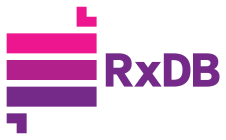

<!--
| Announcement                                                        |
| :--: |
| &emsp;&emsp;&emsp;&emsp;&emsp;&emsp;&emsp;&emsp;&emsp;&emsp;&emsp;&emsp; [Help testing the RxDB version 16 release](https://github.com/pubkey/rxdb/issues/6650) &emsp;&emsp;&emsp;&emsp;&emsp;&emsp;&emsp;&emsp;&emsp;&emsp;&emsp;&emsp;&emsp;&emsp; |
-->

<!-- | Announcement                                                        |
| :--: |
| &emsp;&emsp;&emsp;&emsp;&emsp;&emsp;&emsp;&emsp;&emsp;&emsp;&emsp;&emsp; Version **16.0.0** is now released, read the [CHANGELOG](https://rxdb.info/releases/16.0.0.html) &emsp;&emsp;&emsp;&emsp;&emsp;&emsp;&emsp;&emsp;&emsp;&emsp;&emsp;&emsp;&emsp;&emsp; |
 -->

<!--
|                                                                                  Announcement                                                                                  |
| :----------------------------------------------------------------------------------------------------------------------------------------------------------------------------: |
| Please take part in the [RxDB user survey 2023](https://rxdb.info/survey.html). This will help me to better plan the steps for the next major release. (takes about 2 minutes) |
-->

<br />


<p align="center">
  <a href="https://rxdb.info/">
    
  </a>
  <br />
  <br />
  <h3 align="center">A fast, local-first, reactive Database for JavaScript Applications</h3>
</p>


<p align="center">
    <a href="https://github.com/pubkey/rxdb/releases"></a>
    &nbsp;
    <a href="https://rxdb.info/tutorials/typescript.html"></a>
    &nbsp;
    <a href="https://github.com/pubkey/rxdb/blob/master/LICENSE.txt"></a>
    &nbsp;
    <a href="https://github.com/pubkey/rxdb/stargazers"></a>
    &nbsp;
    <a href="https://www.npmjs.com/package/rxdb"></a>   
</p>

<p align="center">
 	  <a href="https://rxdb.info/chat"></a>
	  &nbsp;
    <a href="https://twitter.com/intent/follow?screen_name=rxdbjs"></a>
	  &nbsp;
    <a href="https://www.linkedin.com/company/rxdb"></a>
    &nbsp;
    <a href="https://rxdb.info/newsletter"></a>
</p>


<br />

<h2>
  &nbsp;&nbsp;What is RxDB?
</h2>

<p align="justify">
  RxDB (short for <b>R</b>eactive <b>D</b>ata<b>b</b>ase) is a <a href="https://rxdb.info/articles/local-first-future.html">local-first</a>, NoSQL-database for JavaScript Applications like Websites, hybrid Apps, Electron-Apps, Progressive Web Apps, Deno and <a href="https://rxdb.info/nodejs-database.html">Node.js</a>.
  Reactive means that you can not only query the current state, but <b>subscribe</b> to all state changes like the result of a query or even a single field of a document.
  This is great for UI-based <b>realtime</b> applications in a way that makes it easy to develop and also has great performance benefits but can also be used to create fast backends in Node.js.<br />
  RxDB provides an easy to implement <a href="https://rxdb.info/replication.html">protocol</a> for realtime <b>replication</b> with your existing infrastructure or one of the plugins for <a href="https://rxdb.info/replication-http.html">HTTP</a>, <a href="https://rxdb.info/replication-graphql.html">GraphQL</a>, <a href="https://rxdb.info/replication-couchdb.html">CouchDB</a>, <a href="https://rxdb.info/replication-websocket.html">Websocket</a>, <a href="https://rxdb.info/replication-webrtc.html">WebRTC</a>, <a href="https://github.com/marceljuenemann/rxdb-supabase">Supabase</a>, <a href="https://rxdb.info/replication-firestore.html">Firestore</a>, <a href="https://rxdb.info/replication-nats.html">NATS</a>.<br />
  RxDB is based on a storage interface that enables you to swap out the underlying storage engine. This increases <b>code reuse</b> because you can use the same database code for different JavaScript environments by just switching out the storage settings.
</p>

Use the [quickstart](https://rxdb.info/quickstart.html), read the [documentation](https://rxdb.info/install.html) or explore the [example projects](https://github.com/pubkey/rxdb/tree/master/examples).


<h2>
  &nbsp;&nbsp;Used by <b style="color: #e6008d;">many</b>
</h2>

RxDB is a proven technology used by [thousands of developers](https://github.com/pubkey/rxdb/network/dependents) worldwide. With its flexibility, RxDB is used in a diverse range of apps and services.

<a href="https://rxdb.info/#reviews" target="_blank">

</a>
<br />
(<a href="https://forms.gle/7taae27VqLXqd4sF6">add yours</a>)

<h2>
  &nbsp;&nbsp;Multiplayer realtime applications
  
</h2>


<h2>
  &nbsp;&nbsp;Replicate with your <b style="color: #e6008d;">existing infrastructure</b>
</h2>

RxDB provides an easy to implement, <b>battle-tested</b> <a href="https://rxdb.info/replication.html">Sync Engine</a> for <a href="https://rxdb.info/articles/realtime-database.html">realtime</a> replication with your existing infrastructure.<br />
You do not have to use a specific cloud or backend database. The protocol works by implementing three simple HTTP endpoints.
There are also production-ready plugins to easily replicate with <a href="https://rxdb.info/replication-graphql.html">GraphQL</a>, <a href="https://rxdb.info/replication-couchdb.html">CouchDB</a>, <a href="https://rxdb.info/replication-websocket.html">Websocket</a>, <a href="https://rxdb.info/replication-webrtc.html">WebRTC (P2P)</a>,<a href="https://github.com/marceljuenemann/rxdb-supabase">Supabase</a>, <a href="https://rxdb.info/replication-firestore.html">Firestore</a> or <a href="https://rxdb.info/replication-nats.html">NATS</a>.


<h2>
  &nbsp;&nbsp;<b style="color: #8D2089;">Flexible</b> storage layer
</h2>

RxDB is based on a [storage interface](https://rxdb.info/rx-storage.html) that enables you to swap out the underlying storage engine. This increases **code reuse** because the same database code can be used in different JavaScript environments by just switching out the storage settings.

You can use RxDB on top of [IndexedDB](https://rxdb.info/rx-storage-indexeddb.html), [OPFS](https://rxdb.info/rx-storage-opfs.html), [LokiJS](https://rxdb.info/rx-storage-lokijs.html), [Dexie.js](https://rxdb.info/rx-storage-dexie.html), [in-memory](https://rxdb.info/rx-storage-memory.html), [SQLite](https://rxdb.info/rx-storage-sqlite.html), in a [WebWorker](https://rxdb.info/rx-storage-worker.html) thread and even on top of [FoundationDB](https://rxdb.info/rx-storage-foundationdb.html) and [DenoKV](https://rxdb.info/rx-storage-denokv.html).

No matter what kind of runtime you have, as long as it runs JavaScript, it can run RxDB:

<h4>
  
  
  
  
  
  <a href="./examples/angular">Browsers</a>
  
  <a href="./examples/node">Node.js</a>
  
  <a href="https://rxdb.info/react-native-database.html">React Native</a>
  
  <a href="https://rxdb.info/capacitor-database.html">Capacitor</a>
  
  <a href="https://github.com/herefishyfish/rxdb-nativescript">NativeScript</a>
  
  <a href="./examples/flutter">Flutter</a>
  or as an 
  <a href="https://rxdb.info/electron-database.html">Electron Database</a>
</h4>


<h2>
  All the features that you need
</h2>

Since its beginning in 2018, RxDB has gained a huge set of features and plugins which makes it a flexible full solution regardless of which type of application you are building. Every feature that you need now or might need in the future is already there.


<table>
  <tr>
    <td>
      <a href="https://rxdb.info/logger.html">Logging</a><br>
      <a href="https://rxdb.info/rx-attachment.html">Attachments</a><br>
      <a href="https://rxdb.info/orm.html">ORM</a><br>
      <a href="https://rxdb.info/transactions-conflicts-revisions.html">Conflict Handling</a><br>
      <a href="https://rxdb.info/middleware.html">Middleware</a><br>
      <a href="https://rxdb.info/reactivity.html">Signals</a>
    </td>
    <td>
      <a href="https://rxdb.info/rx-state.html">State</a><br>
      <a href="https://rxdb.info/backup.html">Backup</a><br>
      <a href="https://rxdb.info/replication.html">Replication</a><br>
      <a href="https://rxdb.info/rx-server.html">Server</a><br>
      <a href="https://rxdb.info/rx-storage.html">Storages</a><br>
      <a href="https://rxdb.info/rx-local-document.html">Local Documents</a>
    </td>
    <td>
      <a href="https://rxdb.info/schema-validation.html">Schema Validation</a><br>
      <a href="https://rxdb.info/key-compression.html">Compression</a><br>
      <a href="https://rxdb.info/migration-schema.html">Migration</a><br>
      <a href="https://rxdb.info/encryption.html">Encryption</a><br>
      <a href="https://rxdb.info/crdt.html">CRDT</a><br>
      <a href="https://rxdb.info/population.html">Population</a>
    </td>
  </tr>
</table>

<!-- - [Logging](https://rxdb.info/logger.html)
- [Attachments](https://rxdb.info/rx-attachment.html)
- [ORM](https://rxdb.info/orm.html)
- [Conflict Handling](https://rxdb.info/transactions-conflicts-revisions.html)
- [Middleware](https://rxdb.info/middleware.html)
- [Signals](https://rxdb.info/reactivity.html)
- [State](https://rxdb.info/rx-state.html)
- [Backup](https://rxdb.info/backup.html)
- [Replication](https://rxdb.info/replication.html)
- [Server](https://rxdb.info/rx-server.html)
- [Storages](https://rxdb.info/rx-storage.html)
- [Local Documents](https://rxdb.info/rx-local-document.html)
- [Schema Validation](https://rxdb.info/schema-validation.html)
- [Compression](https://rxdb.info/key-compression.html)
- [Migration](https://rxdb.info/migration-schema.html)
- [Encryption](https://rxdb.info/encryption.html)
- [CRDT](https://rxdb.info/crdt.html)
- [Population](https://rxdb.info/population.html) -->


<h2>
  &nbsp;&nbsp;Quick start
</h2>


#### Install

```sh
npm install rxdb rxjs --save
```

#### Store data

```javascript
import { 
  createRxDatabase
} from 'rxdb/plugins/core';

/**
 * For browsers, we use the dexie.js based storage
 * which stores data in IndexedDB in the browser.
 * In other JavaScript runtimes, we can use different storages:
 * @link https://rxdb.info/rx-storage.html
 */
import { getRxStorageDexie } from 'rxdb/plugins/storage-dexie';

// create a database
const db = await createRxDatabase({
    name: 'heroesdb', // the name of the database
    storage: getRxStorageDexie()
});

// add collections
await db.addCollections({
  heroes: {
    schema: mySchema
  }
});

// insert a document
await db.heroes.insert({
  name: 'Bob',
  healthpoints: 100
});
```

#### Query data once
```javascript
const aliveHeroes = await db.heroes.find({
  selector: {
    healthpoints: {
      $gt: 0
    }
  }
}).exec(); // the exec() returns the result once
```

#### Observe a Query
```javascript
await db.heroes.find({
  selector: {
    healthpoints: {
      $gt: 0
    }
  }
})
.$ // the $ returns an observable that emits each time the result set of the query changes
.subscribe(aliveHeroes => console.dir(aliveHeroes));
```


<h2>
  &nbsp;&nbsp;Get started
</h2>


Get started now by [reading the docs](https://rxdb.info/quickstart.html) or exploring the [example-projects](./examples).

<h2>
  &nbsp;&nbsp;Support and Contribute
</h2>

- **Leave a Star ☝️**
- [Check out how you can contribute to this project](https://rxdb.info/contribution.html).
- [Read this when you have found a bug](./orga/bug-checklist.md)
- [Buy access to the premium plugins](https://rxdb.info/premium/)
- [Join us at discord to get help](https://rxdb.info/chat)
- [Follow us at LinkedIn](https://www.linkedin.com/company/rxdb/)
- [Give Feedback (anonymous)](https://forms.gle/vGaZB7zrub1hgqDk8)

<!-- 
  There are many websites that just exact-copy the readme of github projects.
  This generates free backlinks so we add some links here to pages
  that we need to rank better.
-->
#### More content
[Angular Database](https://rxdb.info/articles/angular-database.html), [Frontend Database](https://rxdb.info/articles/frontend-database.html), [localStorage](https://rxdb.info/articles/localstorage.html), [React Database](https://rxdb.info/articles/react-database.html), [Browser Database](https://rxdb.info/articles/browser-database.html), [React Native Database](https://rxdb.info/react-native-database.html), [PWA Database](https://rxdb.info/articles/progressive-web-app-database.html), [In-memory NoSQL database](https://rxdb.info/articles/in-memory-nosql-database.html), [JSON database](https://rxdb.info/articles/json-database.html), [Angular IndexedDB](https://rxdb.info/articles/angular-indexeddb.html), [React IndexedDB](https://rxdb.info/articles/react-indexeddb.html), [Optimistic UI](https://rxdb.info/articles/optimistic-ui.html), [local database](https://rxdb.info/articles/local-database.html), [React Native Encryption](https://rxdb.info/articles/react-native-encryption.html), [Vue Database](https://rxdb.info/articles/vue-database.html), [jQuery Database](https://rxdb.info/articles/jquery-database.html), [Vue IndexedDB](https://rxdb.info/articles/vue-indexeddb.html), [Firestore Alternative](https://rxdb.info/articles/firestore-alternative.html), [Firebase Realtime Database Alternative](https://rxdb.info/articles/firebase-realtime-database-alternative.html), [Ionic Storage](https://rxdb.info/articles/ionic-storage.html)

