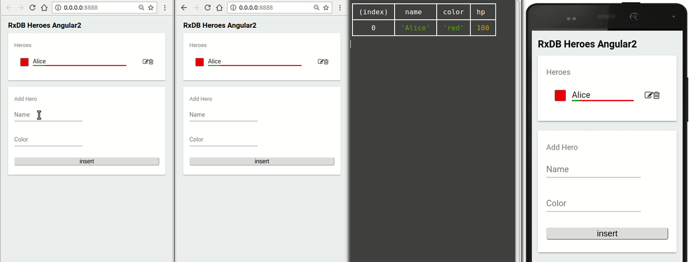

<!--
| Announcement                                                        |
| :--: |
| &emsp;&emsp;&emsp;&emsp;&emsp;&emsp;&emsp;&emsp;&emsp;&emsp;&emsp;&emsp; Version **8.0.0** is now released, read the [ANNOUNCEMENT](./orga/releases/8.0.0.md) &emsp;&emsp;&emsp;&emsp;&emsp;&emsp;&emsp;&emsp;&emsp;&emsp;&emsp;&emsp;&emsp;&emsp; |
-->

<p align="center">
  <a href="https://github.com/pubkey/rxdb">
    
  </a>
</p>

<h1 align="center">RxDB</h1>
<p align="center">
  <strong>A realtime Database for JavaScript Applications</strong>
</p>

<p align="justify">
  RxDB (short for <b>R</b>eactive <b>D</b>ata<b>b</b>ase) is a NoSQL-database for JavaScript Applications like Websites, hybrid Apps, Electron-Apps and NodeJs.
  Reactive means that you can query the current state and <b>subscribe</b> to all state-changes, such as the result of a query or even a single field of a document.
  This is useful for <b>UI-based</b> apps that always display the realtime state to the user.
    RxDB can do a realtime replication with any <b>CouchDB</b> compliant endpoint and also with <b>GraphQL</b> endpoints.
</p>


<div align="center">
  <h3>
    <a href="https://rxdb.info/">Documentation</a>
    <span> | </span>
    <a href="https://github.com/pubkey/rxdb/tree/master/examples">Example-Projects</a>
  </h3>
</div>

<p align="center">
  <a href="https://gitter.im/pubkey/rxdb">
    
  </a>
  <a href="https://twitter.com/intent/follow?screen_name=rxdbjs">
      </a>
  </a>
<!--  <a href="https://www.patreon.com/rxdb">
    
  </a> -->
</p>

<br/>





* * *


|     | **Features**                                                                                                                                                                                                                            |
| --- | --------------------------------------------------------------------------------------------------------------------------------------------------------------------------------------------------------------------------------------- |
| 💻📱  | **Multiplatform support** for browsers, nodejs, electron, cordova, react-native and every other javascript-runtime                                                                                                                      |
| 📨 | **Reactive** data-handling based on [RxJS](https://github.com/ReactiveX/rxjs)                                                                                                                                                           |
| 🚣 | **Offline first** let your app still work when the users has no internet                                          
| 🔄  | **Replication** between client and server-data, compatible with PouchDB, CouchDB and IBM Cloudant. There is also a plugin for a **GraphQL replication** |
| 📄  | **Schema-based** with the easy-to-learn standard of [json-schema](https://json-schema.org/)                                                                                                                                                                        |
| 🍊  | **Mango-Query** exactly like you know from mongoDB and mongoose  <!-- IMPORTANT: It is really called 'mango' query, do not make a PR to fix this 'typo' https://github.com/cloudant/mango -->                                                                                                                    |
| 🔐  | **Encryption** of single data-fields to protect your users data                                                                                                                                                                         |
| 📤📥  | **Import/Export** of the database-state (json), awesome for coding with [TDD](https://en.wikipedia.org/wiki/Test-driven_development)                                                                                                    |
| 📡  | **Multi-Window** to synchronise data between different browser-windows or nodejs-processes                                                                                                                                              |
| 💅 | **ORM-capabilities** to easily handle data-code-relations and customize functions of documents and collections                                                                                                                                                                               |
| 🔷  | Full **TypeScript** support for fast and secure coding                                                                                                                                              |

## Platform-support

RxDB is made so that you can use **exactly the same code** at

-   
    
    
    
     Browsers
-    [NodeJS](https://nodejs.org/en/)
-    [Electron](https://electronjs.org/)
-    [React-Native](https://facebook.github.io/react-native/)
-    [Cordova/Phonegap](https://cordova.apache.org/)

We optimized, double-checked and made boilerplates so you can directly start to use RxDB with frameworks like

-    [React](https://reactjs.org/)
-    [Angular/ng2](https://angular.io/)
-    [Ionic2](https://ionicframework.com/)
-    [Vuejs](https://vuejs.org/)

## Quickstart

### Installation:

```sh
npm install rxdb --save

# peerDependencies
npm install rxjs --save
```

### Import:

<details>
  <summary>ES7</summary>

```javascript
import RxDB from 'rxdb';
const db = await RxDB.create({
    name: 'heroesdb',
    adapter: 'websql',
    password: 'myLongAndStupidPassword', // optional
    multiInstance: true                  // default: true
  });                                                       // create database

await db.collection({name: 'heroes', schema: mySchema});    // create collection
db.heroes.insert({ name: 'Bob' });                          // insert document
```

</details>

<details>
  <summary>ES5</summary>

```javascript
var RxDB = require('rxdb');
RxDB.create({
    name: 'heroesdb',
    adapter: 'websql',
    password: 'myLongAndStupidPassword', // optional
    multiInstance: true                  // default: true
  })                                                                              // create database
  .then(function(db) {return db.collection({name: 'heroes', schema: mySchema});}) // create collection
  .then(function(collection) {collection.insert({name: 'Bob'});})                 // insert document
```

</details>

## Feature-Showroom (click to toggle)

<details>
<summary>
  <b>Mango-Query</b>
  <p>

To find data in your collection, use the [mquery](https://github.com/aheckmann/mquery) api to create chained mango-queries, which you maybe know from **mongoDB** or **mongoose**.

  </p>
</summary>

```javascript
myCollection
  .find()
  .where('name').ne('Alice')
  .where('age').gt(18).lt(67)
  .limit(10)
  .sort('-age')
  .exec().then( docs => {
    console.dir(docs);
  });
```

</details>

<details>
<summary>
  <b>Reactive</b>
  <p>

RxDB implements [rxjs](https://github.com/ReactiveX/rxjs) to make your data reactive.
This makes it easy to always show the real-time database-state in the dom without manually re-submitting your queries.</p>

</summary>

```javascript
db.heroes
  .find()
  .sort('name')
  .$ // <- returns observable of query
  .subscribe( docs => {
    myDomElement.innerHTML = docs
      .map(doc => '<li>' + doc.name + '</li>')
      .join();
  });
```


</details>

<details>
<summary>
  <b>MultiWindow/Tab</b>
  <p>

When two instances of RxDB use the same storage-engine, their state and action-stream will be broadcasted.
This means with two browser-windows the change of window #1 will automatically affect window #2. This works completely offline.

</p>
</summary>


</details>

<details>
<summary>
  <b>Replication</b>
  <p>

Because RxDB relies on glorious [PouchDB](https://github.com/pouchdb/pouchdb), it is easy to replicate
the data between devices and servers. And yes, the changeEvents are also synced.</p>

</summary>


</details>

<details>
<summary>
  <b>Schema</b>
  <p>

Schemas are defined via [jsonschema](http://json-schema.org/) and are used to describe your data.</p>

</summary>

```javascript
const mySchema = {
    title: "hero schema",
    version: 0,                 // <- incremental version-number
    description: "describes a simple hero",
    type: "object",
    properties: {
        name: {
            type: "string",
            primary: true       // <- this means: unique, required, string and will be used as '_id'
        },
        secret: {
            type: "string",
            encrypted: true     // <- this means that the value of this field is stored encrypted
        },
        skills: {
            type: "array",
            maxItems: 5,
            uniqueItems: true,
            item: {
                type: "object",
                properties: {
                    name: {
                        type: "string"
                    },
                    damage: {
                        type: "number"
                    }
                }
            }
        }
    },
    required: ["color"]
};
```

</details>

<details>
<summary>
  <b>Encryption</b>
  <p>

By setting a schema-field to `encrypted: true`, the value of this field will be stored in encryption-mode and can't be read without the password. Of course you can also encrypt nested objects. Example:</p>

</summary>

```json
"secret": {
  "type": "string",
  "encrypted": true
}
```

</details>

<details>
<summary>
  <b>Level-adapters</b>
  <p>

The underlying pouchdb can use different <a href="https://pouchdb.com/adapters.html">adapters</a> as storage engine. So you can use RxDB in different environments by just switching the adapter.
For example you can use websql in the browser, localstorage in mobile-browsers and a leveldown-adapter in nodejs.</p>

</summary>

```js
// this requires the indexeddb-adapter
RxDB.plugin(require('pouchdb-adapter-idb'));
// this creates a database with the indexeddb-adapter
const database = await RxDB.create({
    name: 'mydatabase',
    adapter: 'idb' // the name of your adapter
});
```

There is a [big ecosystem](https://rxdb.info/adapters.html) of adapters you can use.
    </details>

<details>
<summary>
  <b>Import / Export</b>
  <p>

RxDB lets you import and export the whole database or single collections into json-objects. This is helpful to trace bugs in your application or to move to a given state in your tests.</p>

</summary>

```js
// export a single collection
const jsonCol = await myCollection.dump();

// export the whole database
const jsonDB = await myDatabase.dump();

// import the dump to the collection
await emptyCollection.importDump(json);


// import the dump to the database
await emptyDatabase.importDump(json);
```

</details>

<details>
<summary>
  <b>Leader-Election</b>
  <p>

Imagine your website needs to get a piece of data from the server once every minute. To accomplish this task
you create a websocket or pull-interval. If your user now opens the site in 5 tabs parallel, it will run the interval
or create the socket 5 times. This is a waste of resources which can be solved by RxDB's LeaderElection.</p>

</summary>

```js
myRxDatabase.waitForLeadership()
  .then(() => {
      // this will only run when the instance becomes leader.
      mySocket = createWebSocket();
  });
```

In this example the leader is marked with the crown ♛


</details>

<details>
<summary>
  <b>Key-Compression</b>
  <p>

Depending on which adapter and in which environment you use RxDB, client-side storage is [limited](https://pouchdb.com/2014/10/26/10-things-i-learned-from-reading-and-writing-the-pouchdb-source.html) in some way or the other. To save disc-space, RxDB has an internal schema-based key-compression to minimize the size of saved documents.</p>

</summary>

Example:

```js
// when you save an object with big keys
await myCollection.insert({
  firstName: 'foo'
  lastName:  'bar'
  stupidLongKey: 5
});

// RxDB will internally transform it to
{
  '|a': 'foo'
  '|b':  'bar'
  '|c': 5
}

// so instead of 46 chars, the compressed-version has only 28
// the compression works internally, so you can of course still access values via the original key.names
console.log(myDoc.firstName);
// 'foo'
```

</details>

<details>
<summary>
  <b>QueryChangeDetection</b>
  <p>
    Similar to Meteors <a href="https://github.com/meteor/docs/blob/version-NEXT/long-form/oplog-observe-driver.md">oplog-observe-driver</a>,
    RxDB has a QueryChangeDetection to optimize observed or reused queries. This makes sure that when you update/insert/remove documents,
    the query does not have to re-run over the whole database but the new results will be calculated from the events. This creates a huge performance-gain
    with zero cost. The QueryChangeDetection works internally and is currently in <b>beta</b> (disabled by default).
  </p>
</summary>

### Use-Case-Example

Imagine you have a very big collection with many user-documents. At your page you want to display a toplist with users which have the most `points` and are currently logged in.
You create a query and subscribe to it.

```js
const query = usersCollection.find().where('loggedIn').eq(true).sort('points');
query.$.subscribe(users => {
    document.querySelector('body').innerHTML = users
        .reduce((prev, cur) => prev + cur.username+ '<br/>', '');
});
```

As you may detect, the query can take very long time to run, because you have thousands of users in the collection.
When a user now logs off, the whole query will re-run over the database which takes again very long.

```js
anyUser.loggedIn = false;
await anyUser.save();
```

But not with the QueryChangeDetection enabled.
Now, when one user logs off, it will calculate the new results from the current results plus the RxChangeEvent. This often can be done in-memory without making IO-requests to the storage-engine. The QueryChangeDetection not only works on subscribed queries, but also when you do multiple `.exec()`'s on the same query.

</details>

## Browser support

All major evergreen browsers and IE11 are supported. Tests automatically run against Firefox and Chrome, and manually in a VirtualBox for IE11 and Edge.

We soon will switch to [Browserstack](https://www.browserstack.com/) and run automated tests in all major browsers<br/>

<div align="center">
    
</div>

As RxDB heavily relies on PouchDB, see [their browser support](https://pouchdb.com/learn.html#browser_support) for more information. Also do keep in mind that different browsers have different storage limits, especially on mobile devices.

## Getting started

Get started now by [reading the docs](https://rxdb.info/) or exploring the [example-projects](./examples).

## Contribute

[Check out how you can contribute to this project](./docs-src/contribute.md).

## Follow up

-   Follow RxDB on [twitter](https://twitter.com/intent/follow?screen_name=rxdbjs) to not miss the latest enhancements.
-   Join the chat on [gitter](https://gitter.im/pubkey/rxdb) for discussion.

# Thank you

A big **Thank you** to every [contributor](https://github.com/pubkey/rxdb/graphs/contributors) of this project.

## License

[Apache-2.0](https://github.com/pubkey/rxdb/blob/master/LICENSE.txt)
