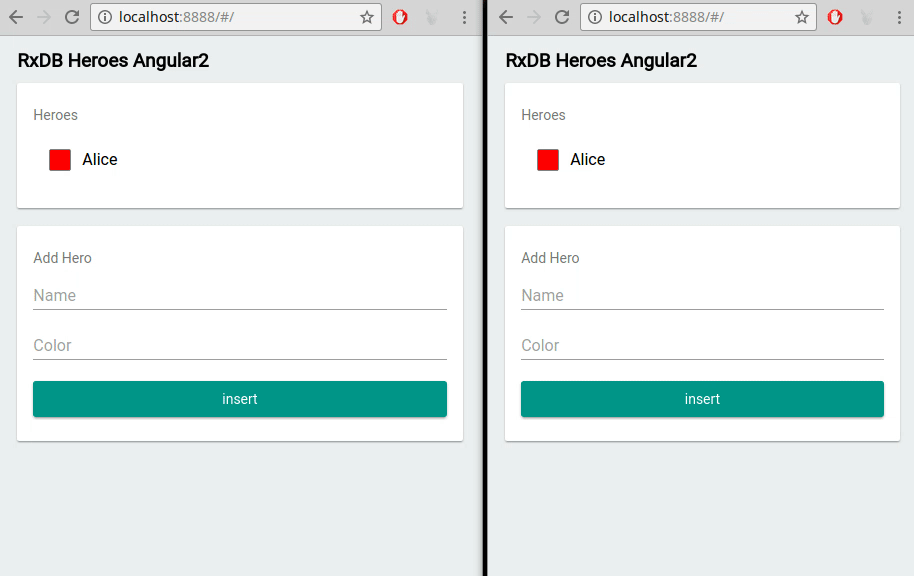

<p align="center">
  <a href="https://github.com/pubkey/rxdb">
    
  </a>
</p>

<h1 align="center">
  <strong>A realtime Database for JavaScript Applications</strong>
</h1>
<p align="justify">
  RxDB (short for <b>R</b>eactive <b>D</b>ata<b>b</b>ase) is a NoSQL-database for JavaScript Applications like Websites, hybrid Apps, Electron-Apps, Progressive Web Apps and NodeJs.
  Reactive means that you can not only query the current state, but <b>subscribe</b> to all state changes like the result of a query or even a single field of a document.
  This is great for UI-based <b>realtime</b> applications in way that makes it easy to develop and also has great performance benefits. To replicate data between your clients and server, RxDB provides modules for realtime replication with any <b>CouchDB</b> compliant endpoint and also with custom <b>GraphQL</b> endpoints.
</p>

<p align="center">
  <a href="https://gitter.im/pubkey/rxdb">
    
  </a>
  <a href="https://twitter.com/rxdbjs">
    
  </a>
<!--  <a href="https://www.patreon.com/rxdb">
    
  </a> -->
</p>


<h2 align="center">
  <strong>Core features</strong>
</h2>


<h3>
  <strong>Realtime Queries</strong>
</h3>

<p align="justify">
In addition to normal pull-based queries, RxDB is capable of having so called <b>realtime queries</b>. These do not only give you the results once but instead emit the new query results each time the state of your database changes.
The stream comes as simple <a href="https://github.com/ReactiveX/rxjs" target="_blank">RxJS</a> Observable and works flawless together with your frontend framework.
</p>

```javascript
db.heroes
  .find({
    sort: ['name']
  })
  .$ // <- returns observable of query
  .subscribe( docs => {
    myDomElement.innerHTML = docs
      .map(doc => '<li>' + doc.name + '</li>')
      .join();
  });
```


<h3>
  <strong>Replication</strong>
</h3>

<p align="justify">
  To synchronize data between your clients and your server, RxDB provides replication modules for <b>CouchDB</b> and <b>GraphQL</b>. So when your server changes data, your application will automatically stream that change to the client and updates its visual representation.
</p>


<h3>
  <strong>Multi-Window / Tab Support</strong>
</h3>

<p align="justify">
  When your application is opened in multiple windows or tabs at the same time, it can be tricky to synchronize actions between the open states. RxDB automatically broadcasts all changes between these tabs so you do not have to take any care of it.
</p>

<center>
  
</center>


<h2>
  <strong>Other features</strong>
</h2>

<h4>
  <strong>Schema</strong>
</h4>

<p align="justify">
  RxDB is based on <a href="https://json-schema.org/">json-schema</a> where the structure of documents is defined for each collection. This is useful when you develop in a team with multiple developers. It also provides information for RxDB to do performance optimizations. Also the schema is versionized and you can provide migration strategies to migrate the data which is already stored on the clients.
</p>

<h4>
  <strong>Encryption</strong>
</h4>

<p align="justify">
  RxDB comes with an encryption module where specific fields of a document can be stored encrypted. So when your clients device is stolen or hacked, you can be sure that sensitive data is not readable by third parties.
</p>

<h4>
  <strong>Key Compression</strong>
</h4>
<p align="justify">
  Saving data on a client can be tricky because you cannot predict how much storage capacity will be available. RxDB provides a key-compression module that compresses the stored json documents which saves about 40% of storage space.
</p>


<br/><br/><br/>
<p align="center">
    <b>If you are new to RxDB, you should continue reading the documentation <a href="./install.html">here.</a></b>
</p>
