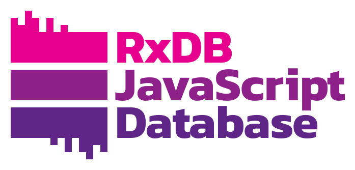

import {Steps} from '@site/src/components/steps';
import {VideoBox} from '@site/src/components/video-box';
import {Tabs} from '@site/src/components/tabs';
import {QuoteBlock} from '@site/src/components/quoteblock';
import {BetaBlock} from '@site/src/components/beta-block';

# How Local-First and WebMCP make your app accessible to agents

Over the past few years, the **[Local-First](./articles/local-first-future.md) architecture** has emerged as a new standard for building fast, offline-capable applications. Now, the long-awaited introduction of **WebMCP** makes local-first even more useful. By keeping data local, AI Agents can access, query, and mutate application states instantaneously on the client side, bypassing the latency and security vulnerabilities of traditional cloud APIs.

> WebMCP provides a formalized machine interface alongside the human interface.

## What is WebMCP?

[WebMCP](https://webmachinelearning.github.io/webmcp/) (Web Model Context Protocol) is an experimental browser API that allows your web application to seamlessly expose "tools" for AI Agents. WebMCP is an adaptation of the Model Context Protocol (MCP) standardized for use within web browsers, currently incubated through the W3C Web Machine Learning community group.

When an AI Agent is active, it can discover these tools and call them programmatically with arguments as defined by a strict JSON Schema, via the `navigator.modelContext` API.

```ts
// Example: Registering a simple WebMCP tool natively
navigator.modelContext.registerTool({
    name: 'get_weather',
    description: 'Returns the current weather for a city',
    inputSchema: {
        type: 'object',
        properties: {
            city: { type: 'string' }
        },
        required: ['city']
    }
}, async (params) => {
    return fetch(`/api/weather?city=${params.city}`);
});
```

## The End of Scraping

WebMCP transforms the browser from a visual document viewer into a semantic capability surface.

For years, automation and AI have relied on simulating human inputs: guessing CSS class names `.button-primary`, parsing accessibility trees, and breaking whenever a layout changes. This "pixels-as-APIs" approach is slow, brittle, and highly token-dependent.

WebMCP provides a formalized machine interface alongside the human interface. By exposing deterministic, schema-validated tools, WebMCP closes the execution gap. AI Agents no longer guess how to interact with an application; they are given a precise contract defining exactly what operations are available and what payloads they accept. 


<QuoteBlock
  author="rand42"
  year="2026"
  sourceLink="https://news.ycombinator.com/item?id=47213538"
>I personally think these AI agents are inevitable. Like we adapted to Mobile from Desktop, its time to build websites and services for AI agents.</QuoteBlock>


## Benefits of WebMCP

WebMCP introduces massive structural advantages over traditional browser automation:
- **Token Efficiency**: Providing structured JSON schemas to LLMs requires far fewer tokens than dumping raw DOM layout elements or accessibility trees into the prompt context.
- **Bypass Bot Protection**: Rather than forcing AI to use brittle DOM-scraping (like Selenium) that triggers CAPTCHAs or Cloudflare blocks, WebMCP gives them a sanctioned, highly-structured "front door" API.
- **Better Understanding**: The agent does not have to arbitrarily parse pixels or DOM layouts. Instead, it works directly on the deterministic data structures it receives.
- **Less Hallucination**: Because the agent receives exact data with high precision rather than inferring state from a UI, it is significantly less prone to hallucinating facts.
- **Access Control**: Developers have granular control over exactly what an agent can and cannot do by explicitly defining and exposing only specific WebMCP tools.


<center>
<br />
<VideoBox videoId="d2B009ZTDxY" title="Expose your apps to AI with WebMCP" duration="1:46" />
<br />
<br />
</center>

## Why Local-First and RxDB work great with WebMCP

WebMCP is uniquely powerful when paired with [local-first](/articles/local-first-future.md) databases like RxDB:
- **Unlimited Options**: Traditional websites must code a specific WebMCP tool for every possible action (e.g. `getProductsByPrice`, `searchProductsByColor`, `additemToCart`). By exposing a local-first database, the AI Agent has unlimited generic query and mutation options mathematically bound only by your schema.
- **Zero Latency**: Agents query data instantly from the local database on the user's device.
- **Offline Capable**: Because the data and the API are local, AI Agents can assist users completely offline.
- **Privacy First**: Sensitive user data can stay on the device while still being queryable by the on-device AI model.
- **Direct Access**: Agents can bypass the UI entirely and find exactly what they need with basic NoSQL queries.
- **LLM-Friendly NoSQL**: Writing NoSQL query objects (like [Mongo-style queries](./rx-query.md)) is significantly easier and more deterministic for LLMs to generate and validate than orchestrating complex, string-based SQL JOIN queries.
- **Native JSONSchema**: WebMCP relies entirely on JSONSchema to define tools and parameters. Because [RxDB schemas are *already* written in JSONSchema](./rx-schema.md), there is zero translation overhead, meaning the agent receives the exact structural contract it expects.


<center>
    <a href="https://rxdb.info/">
        
    </a>
</center>


### Example Use Cases

Exposing your local database to AI agents unlocks new user experiences beyond what is possible with traditional websites.

**Online Shop**

An AI Agent searches your local catalog for items based on complex criteria, such as "Find all in-stock items cheaper than $50 that have a blue color". The agent can issue a highly efficient NoSQL query via WebMCP to retrieve all in-stock items under $50, and then seamlessly read through the returned JSON block to filter out the blue ones using its own internal LLM reasoning. Without a local-first database, developers would have to manually implement and maintain specific server-side WebMCP endpoints (e.g., `getItemsUnder50`) for every possible filtering combination the user might ask for, or expose a dynamic endpoint which queries the backend database but has unpredictable performance risks and massive security problems.

**Grocery Shopping List**

An agent can manage your list by using WebMCP modification tools in real time. If a user says "Move all drinks from Shop A to Shop B", the AI first uses `rxdb_query` to find all items categorized as drinks assigned to Shop A. It then uses the `rxdb_upsert` tool to update those specific documents to belong to Shop B. Alternatively, if a user says "Add everything I need to bake a cheesecake", the AI determines the ingredients and uses the `rxdb_insert` tool multiple times to instantly populate the local UI with the new shopping items, and `rxdb_delete` to remove items when the user says "I already have butter".

**Geotracking App**

Using the [RxDB continuous queries and observables](./reactivity.md) (`rxdb_wait_changes`), an agent monitors live tracking data to notify the user when a specific object starts moving.


## The RxDB WebMCP Plugin

RxDB provides a plugin `rxdb/plugins/webmcp` that lets you expose your collections to WebMCP with just a single function call.

The plugin dynamically reads your RxDB schema to assemble a prompt description and the tool's `inputSchema` so the AI knows exactly what data shapes are available and how to query them. It automatically registers the following WebMCP tools for each tracked collection:

**Read Operations**:
- `rxdb_query`: Run complex NoSQL queries against the local database.
- `rxdb_count`: Count the number of documents matching a specific query.
- `rxdb_changes`: Fetch the replication changestream since a given checkpoint.
- `rxdb_wait_changes`: Listen to live UI updates by pausing until a matching document changes occurs.

**Write Operations**:
- `rxdb_insert`: Insert new documents into the local collection.
- `rxdb_upsert`: Overwrite existing documents or insert them if they don't exist.
- `rxdb_delete`: Remove items from the local database by ID.

:::note
State-modifying tools like insert/upsert/delete can be disabled via the [`readOnly`](#readonly-default-false) option.
:::

### Quick Start

<Steps>

#### Add the plugin

First, ensure the plugin is added to your RxDB configuration:

```ts
import { addRxPlugin } from 'rxdb';
import { RxDBWebMCPPlugin } from 'rxdb/plugins/webmcp';

addRxPlugin(RxDBWebMCPPlugin);
```

#### Create a database

First, initialize your RxDatabase instance:

```ts
import { createRxDatabase } from 'rxdb';
import { getRxStorageLocalstorage } from 'rxdb/plugins/storage-localstorage';

const db = await createRxDatabase({
    name: 'mydatabase',
    storage: getRxStorageLocalstorage()
});
```

#### Add a Collection

Next, [add a collection](./rx-collection.md) with a simple schema. Providing an accurate schema is critical because the AI agent will use this exact schema to understand your data shape:

```ts
await db.addCollections({
    todos: {
        schema: {
            title: 'Todo App Schema',
            version: 0,
            primaryKey: 'id',
            type: 'object',
            properties: {
                id: { type: 'string', maxLength: 100 },
                name: { type: 'string', description: 'The task title' },
                done: { type: 'boolean' }
            },
            required: ['id', 'name', 'done']
        }
    }
});
```

#### Register Collections

Finally, activate WebMCP on the whole database or specific collections:

```ts
// Expose all collections in the DB to WebMCP (Read-only by default)
db.registerWebMCP();

// Or expose only a specific collection:
db.collections.todos.registerWebMCP();
```

</Steps>


### Options

The `registerWebMCP` method accepts an optional object:

#### `readOnly` (default: `false`)

By default, WebMCP allows modifier tools.
If you explicitly want the agent to only be able to query the database, enable `readOnly`. 

```ts
db.registerWebMCP({
    readOnly: true 
});
```

This skips registering `rxdb_insert`, `rxdb_upsert`, and `rxdb_delete` tools.

#### `awaitReplicationsInSync` (default: `true`)

Because [replications](./replication.md) pull remote data into the local RxDB asynchronously, an AI Agent's query might miss data if a replication is still catching up. By default, WebMCP query invocations await (`awaitInSync()`) all running replications for that collection before returning the query results.

Set this to `false` if you want to allow queries without waiting for replication to be in sync.

```ts
db.registerWebMCP({
    awaitReplicationsInSync: false
});
```

:::warning
If the application is offline and the replication is configured to retry infinitely, querying WebMCP with this option enabled may hang indefinitely while awaiting replication sync. Use wisely.
:::


### Logs and Errors

Both `registerWebMCP` methods (`db.registerWebMCP()` and `db.collections.humans.registerWebMCP()`) return an object containing two RxJS Subjects: `log$` and `error$`.

You can subscribe to these to monitor the AI agent's actions:

```ts
const { log$, error$ } = db.registerWebMCP();

log$.subscribe(info => {
    // Log all tool calls, arguments, and responses
    console.log('WebMCP Agent Action', info);
});

error$.subscribe(err => {
    // Audit failed tool executions
    console.error('WebMCP Agent Error', err);
});
```

### Pro Tip: Schema Descriptions for Better LLM Results

Because WebMCP sends your collection's [JSON schema](./rx-schema.md) directly to the AI Agent, the LLM uses the schema to understand the data model. 
Providing detailed, highly accurate descriptions for your properties significantly improves the LLM's ability to construct valid and precise queries.

<Tabs>

#### Bad Example

```ts
const productSchema = {
    version: 0,
    title: 'Product',
    primaryKey: 'sku',
    type: 'object',
    properties: {
        sku: {
            type: 'string',
            maxLength: 100
        },
        price: {
            type: 'number'
        }
    },
    required: ['sku', 'price']
};
```

#### Good Example

```ts
const productSchema = {
    version: 0,
    title: 'Store Product Inventory Item',
    description: 'A physical item sold in our e-commerce store. Contains pricing and categorical SKU lookup data.',
    primaryKey: 'sku',
    type: 'object',
    properties: {
        sku: {
            type: 'string',
            maxLength: 100,
            description: 'The Stock Keeping Unit identifier. Consists of a category prefix and a 6-digit number.'
        },
        price: {
            type: 'number',
            minimum: 0,
            multipleOf: 0.01,
            description: 'The price of the product in Euro (€).'
        }
    },
    required: ['sku', 'price']
};
```


</Tabs>


### Security and Prompt Injection

Architecturally, WebMCP turns the browser into a "capability surface" with explicit contracts. Security boundaries are clearer because only declared tools are visible and inputs are strictly validated against schemas.

However, be aware that WebMCP **does not completely eliminate prompt injection risks**. It significantly narrows the surface compared to DOM-level automation, but an Agent mimicking a well-behaved query against your schema can still produce corrupted behavior if the prompt itself contains malicious instructions. Ensure your application logic (and RxDB schema validation) assumes agent-provided payloads are untrusted.


<BetaBlock since="17.0.0">
APIs and behaviors are subject to change as the official <a href="https://webmachinelearning.github.io/webmcp/">W3C WebMCP specification</a> and browser implementations evolve.
</BetaBlock>


## FAQ

<details>
    <summary>What is WebMCP?</summary>
    <div>
        WebMCP (Web Model Context Protocol) is an experimental browser API that allows your web application to seamlessly expose "tools" for AI Agents. It acts as a standardized translation layer between your application's functionality and LLMs running within the browser, enabling natural language interactions with your web application's data. Wait for formal browser support for use in production environments.
    </div>
</details>

<details>
    <summary>How to mix the RxDB WebMCP with own WebMCP tools?</summary>
    <div>
        You can easily mix the RxDB WebMCP tools with your own tools. Since <code>db.registerWebMCP()</code> internally just calls <code>navigator.modelContext.registerTool()</code>, you can simply call this native method yourself to register any additional tools that interact with your frontend logic, external APIs, or other non-database components.
    </div>
</details>

<details>
    <summary>How to use the WebMCP polyfill for browsers without native support?</summary>
    <div>
        Since most browsers do not yet natively implement the <code>navigator.modelContext</code> API, you can use the <a href="https://github.com/WebMCP-org" target="_blank">WebMCP-org</a> polyfill package <code>@mcp-b/global</code> to add support in any browser today.

        Install the package:

        ```bash
        npm install @mcp-b/global
        ```

        Then import it once at the entry point of your application, before any WebMCP tools are registered:

        ```ts
        import '@mcp-b/global';

        // navigator.modelContext is now available
        import { addRxPlugin } from 'rxdb';
        import { RxDBWebMCPPlugin } from 'rxdb/plugins/webmcp';
        addRxPlugin(RxDBWebMCPPlugin);
        ```

        The polyfill sets up the <code>navigator.modelContext</code> interface so that your registered tools are accessible to AI agents running in the browser, even without native browser support.
    </div>
</details>

<details>
<summary>How can I try WebMCP in Chrome?</summary>
<div>

WebMCP is currently in an early preview phase. You can test it today in Chrome Canary (version 145+) by following these steps:

1. **Enable the flag**: Go to `chrome://flags`, search for "WebMCP for testing", enable it, and relaunch Chrome.
2. **Install the inspector extension**: Install the [Model Context Tool Inspector Extension](https://chromewebstore.google.com/detail/model-context-tool-inspec/gbpdfapgefenggkahomfgkhfehlcenpd) to view registered tools, execute them manually, and test with an agent using Gemini API integration.
3. **Use a live demo**: You can test the integration directly on demo pages like the [RxDB WebMCP Quickstart](https://pubkey.github.io/rxdb-quickstart/).

</div>
</details>


## Follow up

To learn more about WebMCP and see it in action, check out these resources:
- [WebMCP Chrome Developer Blog Post](https://developer.chrome.com/blog/webmcp-epp?hl=en)
- [RxDB WebMCP Quickstart Repository](https://github.com/pubkey/rxdb-quickstart)
- [Live WebMCP RxDB Demo](https://pubkey.github.io/rxdb-quickstart/)
- Read: [Why Local-First Software Is the Future and what are its Limitations](/articles/local-first-future.md)


