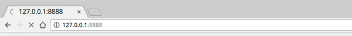

# Leader-Election

RxDB comes with a leader-election which elects a leading instance between different instances in the same javascript runtime.
Before you read this, please check out on how many of your open browser-tabs you have opened the same website more than once. Count them, I will wait..

So if you would now inspect the traffic that these open tabs produce, you can see that many of them send exact the same data over wire for every tab. No matter if the data is sent with an open websocket or by polling.

## Use-case-example

Imagine we have a website which displays the current temperature of the visitors location in various charts, numbers or heatmaps. To always display the live-data, the website opens a websocket to our API-Server which sends the current temperature every 10 seconds. Using the way most sites are currently build, we can now open it in 5 browser-tabs and it will open 5 websockets which send data 6*5=30 times per minute. This will not only waste the power of your clients device, but also wastes your api-servers resources by opening redundant connections.

## Solution

The solution to this redundancy is the usage of a [leader-election](https://en.wikipedia.org/wiki/Leader_election)-algorithm which makes sure that always exactly one tab is managing the remote-data-access. The managing tab is the elected leader and stays leader until it is closed. No matter how many tabs are opened or closed, there must be always exactly **one** leader.
You could now start implementing a messaging-system between your browser-tabs, hand out which one is leader, solve conflicts and reassign a new leader when the old one 'dies'.
Or just use RxDB which does all these things for you.


## Add the leader election plugin

To enable the leader election, you have to add the `leader-election` plugin.

```javascript
import { addRxPlugin } from 'rxdb';
import { RxDBLeaderElectionPlugin } from 'rxdb/plugins/leader-election';
addRxPlugin(RxDBLeaderElectionPlugin);
```
## Code-example

To make it easy, here is an example where the temperature is pulled every ten seconds and saved to a collection. The pulling starts at the moment where the opened tab becomes the leader.

```javascript
const db = await createRxDatabase({
  name: 'weatherDB',
  storage: getRxStorageDexie(),
  password: 'myPassword',
  multiInstance: true
});
await db.addCollections({
  temperature: {
    schema: mySchema
  }
});

db.waitForLeadership()
  .then(() => {
    console.log('Long lives the king!'); // <- runs when db becomes leader
    setInterval(async () => {
      const temp = await fetch('https://example.com/api/temp/');
      db.temperature.insert({
          degrees: temp,
          time: new Date().getTime()
      });
    }, 1000 * 10);
  });
```


## Handle Duplicate Leaders

On rare occasions, it can happen that [more then one leader](https://github.com/pubkey/broadcast-channel/blob/master/.github/README.md#handle-duplicate-leaders) is elected. This can happen when the CPU is on 100% or for any other reason the JavaScript process is fully blocked for a long time.
For most cases this is not really problem because on duplicate leaders, both browser tabs replicate with the same backend anyways.
To handle the duplicate leader event, you can access the leader elector and set a handler:

```ts
import {
    getLeaderElectorByBroadcastChannel
} from 'rxdb/plugins/leader-election';

const leaderElector = getLeaderElectorByBroadcastChannel(broadcastChannel);
leaderElector.onduplicate = async () => {
    // Duplicate leader detected -> reload the page.
    location.reload();
}
```

## Live-Example

In this example the leader is marked with the crown ♛



## Try it out

Run the [vanillaJS-example](https://github.com/pubkey/rxdb/tree/master/examples/vanilla) where the leading tab is marked with a crown on the top-right-corner.

## Notice

The leader election is implemented via the  [broadcast-channel module](https://github.com/pubkey/broadcast-channel#using-the-leaderelection).
The leader is elected between different processes on the same javascript-runtime. Like multiple tabs in the same browser or multiple NodeJs-processes on the same machine. It will not run between different replicated instances.
