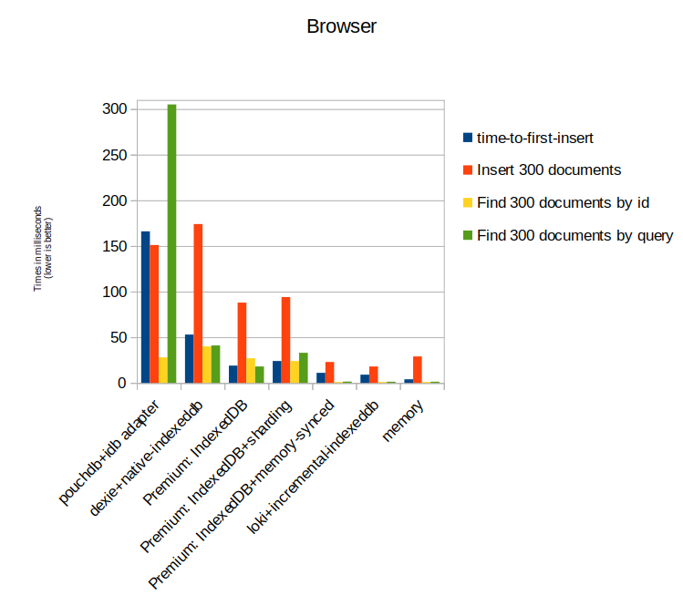

# OPFS RxStorage (beta)


The OPFS [RxStorage](./rx-storage.md) for RxDB is built on top of the [File System Access API](https://webkit.org/blog/12257/the-file-system-access-api-with-origin-private-file-system/) which is available in [all modern browsers](https://caniuse.com/native-filesystem-api). It provides an API to access a sandboxed private file system to persistently store and retrieve data.
Compared to other persistend storage options in the browser (like [IndexedDB](./rx-storage-indexeddb.md)), the OPFS API has a **way better performance**.

<p align="center">
  
</p>

The OPFS API can only be accessed in a [WebWorker](./rx-storage-worker.md). It cannot be accessed in the main JavaSCript process, and Iframe or even a [SharedWorker](./rx-storage-shared-worker.md).


### Pros

- It is really fast, about 3-4 times faster than [IndexedDB](./slow-indexeddb.md)
- It has a small build size.
- It allows to use boolean values as index.

### Cons

- It is part of the [RxDB Premium](https://rxdb.info/premium.html) plugin that must be purchased.
- It must be used in a [WebWorker](./rx-storage-worker.md) which complicates the setup a bit.
- It is in beta mode at the moment which means it can include breaking changes without a RxDB major version increment.


## Usage

The OPFS storage itself must run inside a WebWorker. Therefore we use the [Worker RxStorage](./rx-storage-worker.md) and let it point to the prebuild `opfs.worker.js` file that comes shipped with RxDB Premium.


```ts
import {
    createRxDatabase
} from 'rxdb';
import { getRxStorageWorker } from 'rxdb-premium/plugins/storage-worker';
import { RxStorageOPFSStatics } from 'rxdb-premium/plugins/storage-opfs';

const database = await createRxDatabase({
    name: 'mydatabase',
    storage: getRxStorageWorker(
        {
            statics: RxStorageOPFSStatics,
            /**
             * This file must be statically served from a webserver.
             * You might want to first copy it somewhere outside of
             * your node_modules folder.
             */
            workerInput: 'node_modules/rxdb-premium/dist/workers/opfs.worker.js'
        }
    )
});
```


## Learn more about OPFS:

- [WebKit: The File System API with Origin Private File System](https://webkit.org/blog/12257/the-file-system-access-api-with-origin-private-file-system/)
- [Browser Support](https://caniuse.com/native-filesystem-api)
