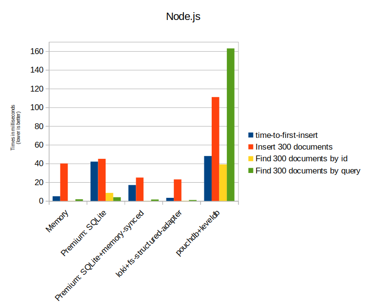

## RxStorage Performance comparison

A big difference in the RxStorage implementations is the performance. In difference to a server side database, RxDB is bound to the limits of the JavaScript runtime. For example in the browser it is only possible to store data in a [slow IndexedDB](./slow-indexeddb.md) instead of a filesystem.

**LokiJS** stores all data in memory and only saves to disc occasionally (or on exit). Therefore it has a very fast read/write performance, but loading all data into memory on the first page load can take longer for big amounts of documents. Also this storage can only be used when all data fits into the memory at least once.

The Premium **sharding** RxStorage is only useful when big amounts of documents have to be stored or queries. In the CI performance test, we only insert a small amount of documents so that the performance actually decreases when sharding is used.

Many storages run lazy, so it makes no sense to compare the time which is required to create a database with collections. Instead we measure the **time-to-first-insert** which is the whole timespan from database creation until the first single document write is done.

  

  

