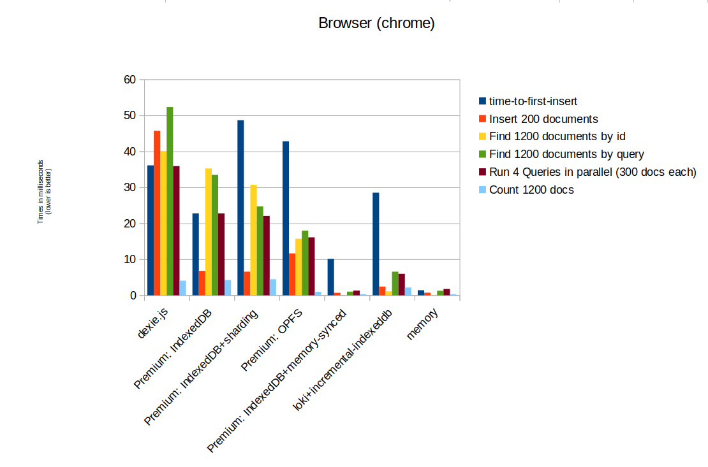
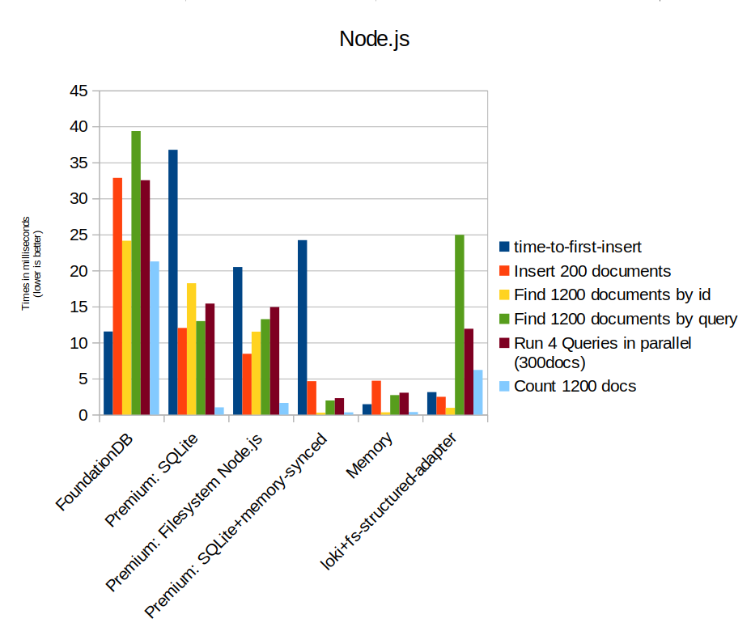

# RxStorage

RxDB is not a self contained database. Instead the data is stored in an implementation of the [RxStorage interface](https://github.com/pubkey/rxdb/blob/master/src/types/rx-storage.interface.d.ts). This allows you to **switch out** the underlying data layer, depending on the JavaScript environment and performance requirements. For example you can use the SQLite storage for a capacitor app or you can use the Dexie.js RxStorage to store data in IndexedDB in a browser based application. There are also storages for other JavaScript runtimes like Node.js, React-Native, NativeScript and more.

## Implementations

### Dexie.js

The Dexie.js based storage is based on the [Dexie.js](https://github.com/dexie/Dexie.js) IndexedDB wrapper.
It stores the data inside of a browsers IndexedDB database and has a very small bundle size. **If you are new to RxDB, you should start with the Dexie.js RxStorage**. [Read more](./rx-storage-dexie.md)

### LokiJS

The LokiJS based storage is based on the [LokiJS](https://github.com/techfort/LokiJS) database.
It has the special behavior of loading all data into memory at app start and therefore has the best performance when running operations over a small to mid sized dataset. [Read more](./rx-storage-lokijs.md)

### Memory

A storage that stores the data in as plain data in the memory of the JavaScript process. Really fast and can be used in all environments. [Read more](./rx-storage-memory.md)

### IndexedDB [[premium](https://rxdb.info/premium.html)]

The IndexedDB `RxStorage` is based on plain IndexedDB. This has the best performance of all other non-in-memory storage, when RxDB is used inside of a browser. [Read more](./rx-storage-indexeddb.md)

### SQLite [[premium](https://rxdb.info/premium.html)]

The SQLite storage has the best performance when RxDB is used on **Node.js**, **Electron**, **React Native**, **Cordova** or **Capacitor**. [Read more](./rx-storage-sqlite.md)

### FoundationDB

To use RxDB on the server side, the FoundationDB RxStorage provides a way of having a secure, fault-tolerant and performant storage. [Read more](./rx-storage-foundationdb.md)

### Worker [[premium](https://rxdb.info/premium.html)]

The worker RxStorage is a wrapper around any other RxStorage which allows to run the storage in a WebWorker (in browsers) or a Worker Thread (in Node.js). By doing so, you can take CPU load from the main process and move it into the worker's process which can improve the perceived performance of your application. [Read more](./rx-storage-worker.md)

### SharedWorker [[premium](https://rxdb.info/premium.html)]

The worker RxStorage is a wrapper around any other RxStorage which allows to run the storage in a SharedWorker (only in browsers). By doing so, you can take CPU load from the main process and move it into the worker's process which can improve the perceived performance of your application. [Read more](./rx-storage-worker.md)

### Remote
The Remote RxStorage is made to use a remote storage and communicate with it over an asynchronous message channel. The remote part could be on another JavaScript process or even on a different host machine. [Read more](./rx-storage-remote.md)

### Sharding [[premium](https://rxdb.info/premium.html)]

On some `RxStorage` implementations (like IndexedDB), a huge performance improvement can be done by sharding the documents into multiple database instances. With the sharding plugin you can wrap any other `RxStorage` into a sharded storage. [Read more](./rx-storage-sharding.md)

### Memory Synced [[premium](https://rxdb.info/premium.html)]

The memory synced [RxStorage](./rx-storage.md) is a wrapper around any other RxStorage. The wrapper creates an in-memory storage that is used for query and write operations. This memory instance is replicated with the underlying storage for persistence.
The main reason to use this is to improve initial page load and query/write times. This is mostly useful in browser based applications. [Read more](./rx-storage-memory-synced.md)

### Localstorage Meta Optimizer [[premium](https://rxdb.info/premium.html)]

The [RxStorage](./rx-storage.md) Localstorage Meta Optimizer is a wrapper around any other RxStorage. The wrapper uses the original RxStorage for normal collection documents. But to optimize the initial page load time, it uses `localstorage` to store the plain key-value metadata that RxDB needs to create databases and collections. This plugin can only be used in browsers. [Read more](./rx-storage-localstorage-meta-optimizer.md)

### Electron IpcRenderer & IpcMain

To use RxDB in [electron](./electron-database.md), it is recommended to run the RxStorage in the main process and the RxDatabase in the renderer processes. With the rxdb electron plugin you can create a remote RxStorage and consume it from the renderer process. [Read more](./electron.md)

## Performance comparison

A big difference in the RxStorage implementations is the performance. In difference to a server side database, RxDB is bound to the limits of the JavaScript runtime. For example in the browser it is only possible to store data in a [slow IndexedDB](./slow-indexeddb.md) instead of a filesystem.

**LokiJS** stores all data in memory and only saves to disc occasionally (or on exit). Therefore it has a very fast read/write performance, but loading all data into memory on the first page load can take longer for big amounts of documents. Also this storage can only be used when all data fits into the memory at least once.

The Premium **sharding** RxStorage is only useful when big amounts of documents have to be stored or queries. In the CI performance test, we only insert a small amount of documents so that the performance actually decreases when sharding is used.

Many storages run lazy, so it makes no sense to compare the time which is required to create a database with collections. Instead we measure the **time-to-first-insert** which is the whole timespan from database creation until the first single document write is done.

  

  

