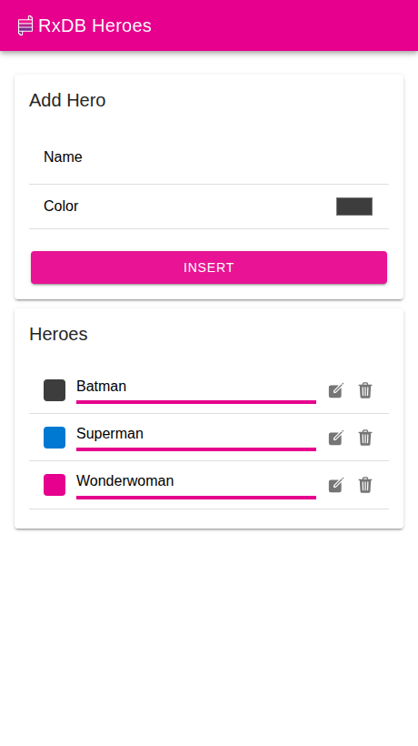

# RxDB Ionic + Capacitor Example

This is a hero list app that shows how to use [RxDB](https://rxdb.info/) inside of an [Ionic](https://ionicframework.com/) app that runs in the browser and, via [Capacitor](https://capacitorjs.com/), on Android and iOS.



The app uses:

- **Ionic 8** with **Angular** standalone components
- **Capacitor 8** for the Android and iOS builds
- The [localstorage RxStorage](https://rxdb.info/rx-storage-localstorage.html) which works in the browser and inside of the Capacitor webview
- Reactive queries, so the list updates whenever a hero is inserted, changed or deleted
- The [multi-tab](https://rxdb.info/leader-election.html) support of RxDB in the browser. Open the app in two tabs and watch both update at the same time

## Try it out in the browser

1. Clone the whole [RxDB repo](https://github.com/pubkey/rxdb)
2. Go to this folder `cd examples/ionic`
3. Run `npm install`
4. Run `npm run dev`
5. Open [http://localhost:8100/](http://localhost:8100/)

## Run it on Android or iOS

The native projects are not checked in, so you have to create them once:

```bash
npm run build
npm run cap:add:android   # or: npm run cap:add:ios
```

Afterwards you can open the project in Android Studio or Xcode:

```bash
npm run cap:open:android  # or: npm run cap:open:ios
```

Both scripts run the web build and `npx cap sync` before opening the native IDE.

## Notice

For the GitHub CI this example installs the local RxDB build (`rxdb-local.tgz`) which is created by the `preinstall` script. In your own app you install `rxdb` from npm instead:

```bash
npm install rxdb rxjs
```

## Storage on native devices

The localstorage RxStorage is used here because it needs no native plugin and works everywhere. When you store many documents on a mobile device, you can switch to the [SQLite RxStorage](https://rxdb.info/rx-storage-sqlite.html) which stores the data outside of the webview. Switching storages is a configuration change, not a rewrite, so only the `storage` field in `src/app/services/database.service.ts` has to be changed.

## Related

- [RxDB Quickstart](https://rxdb.info/quickstart.html)
- [Ionic Database](https://rxdb.info/articles/ionic-database.html)
- [Comparison of Capacitor Databases](https://rxdb.info/capacitor-database.html)
