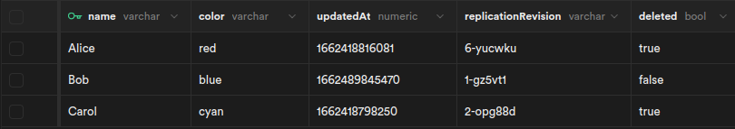

# RxDB Supabase example

This is an example of how to use RxDB on the client and replicate with a [Supabase](https://github.com/supabase/supabase) server in **realtime** so that the data can still be used on the client when the user goes **offline**.

## Try it out

1. Clone the whole [RxDB-repo](https://github.com/pubkey/rxdb) via `git clone https://github.com/pubkey/rxdb.git`
2. Build the RxDB base project `cd rxdb && npm install && npm run build`
3. Go into this folder `cd examples/supabase`
4. Install the frontend libraries via `npm run preinstall && npm install`
5. Start supabase `npm run supabase:start`.
6. Run the frontend via `npm run dev`

-   Open the supabase dashboard at [http://127.0.0.1:54323/](http://127.0.0.1:54323/)
-   Open the frontend at [http://localhost:8888/](http://localhost:8888/)

## Supabase Replication

For the replication, the RxDB [replication protocol](../../docs-src/replication.md) is used which allows a two-way, realtime replication with the supabase server.
To be compatible with the protocol, the pull- and push-handler have been implemented accordingly. Also a `pull.stream$` is implemented with the supabase [changestream](https://supabase.com/docs/reference/javascript/subscribe).
The replication will pause when the user is disconnected from the server and it will automatically continue when the supabase server can be reached again. On reconnects a `RESYNC` flat is emitted from the `pull.stream$` so that the replication will switch into [Checkpoint iteration](../../docs-src/replication.md#checkpoint-iteration) mode to consider any change events that have been missed out during the online time.

See more at [src/replication.ts](./src/replication.ts).

## Conflict resolution

Conflicts are resolved on the client side which makes it easier to have a plain, dumb supabase backend without any complex SQL statements.

To be able to **detect** and **resolve** conflicts, an additional field `replicationRevision` is added to each document/row.
To ensure this field is updated on each write, we add the `preInsert`, `preRemove`, `preSave` hooks [when creating the database](./src/database.ts). These hooks automatically increase the revision `height` and `hash`. This works similar to RxDB's internal [revision handling](../../docs-src/transactions-conflicts-revisions.md).

In the [conflictHandler](./src/conflict-handler.ts) we can compare the `replicationRevision` of two documents to detect if there is a conflict. The current `conflictHandler` drops the local state on conflict and uses the master/server state of the document. You can change the handler to project any additional logic like merging fields or cherry picking the new document state depending on some conditions.

## TODOs

-   The `pull.stream$` currently only processes one document after another instead of processing change-bulks which would be much faster. But atm there is no way to tell supabase to fetch the changes in bulks.
-   The `push.handler` has a `batchSize` of `1` which makes the replication easier to implement. For better performance we could use a supabase [rpc](https://supabase.com/docs/reference/javascript/rpc) call instead.
