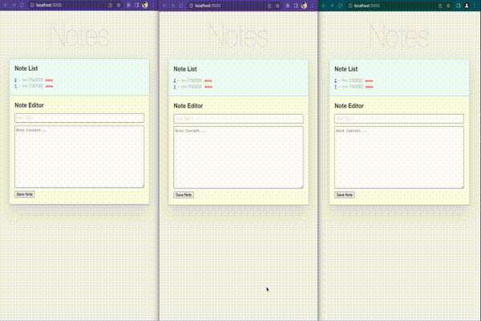

# SvelteKit+RxDB Example

This is an example usage of RxDB with [SvelteKit](http://kit.svelte.dev). It implements a simple note list which can be filled by the user.

# Try it out

1. clone the whole [RxDB-repo](https://github.com/pubkey/rxdb)
2. go into project `cd rxdb`
3. run `npm install`
4. go to this folder `cd examples/svelte-kit`
5. run `npm install`
6. run `npm start` to run pouchdb and `npm run dev` concurrently.
7. Open [http://127.0.0.1:3000/](http://127.0.0.1:3000/) (should open automatically).

# Screenshot


## Important parts when using RxDB with svelte-kit:

-   Make sure you define `global` and `process` are needed for pouchdb in vite configuration.

```js
// in svelte.config.js
...
kit: {
    ...
    vite: {
			define: {
				global: 'window',
				process: { env: {} }
			}
		}
}
```

## Screenshot

