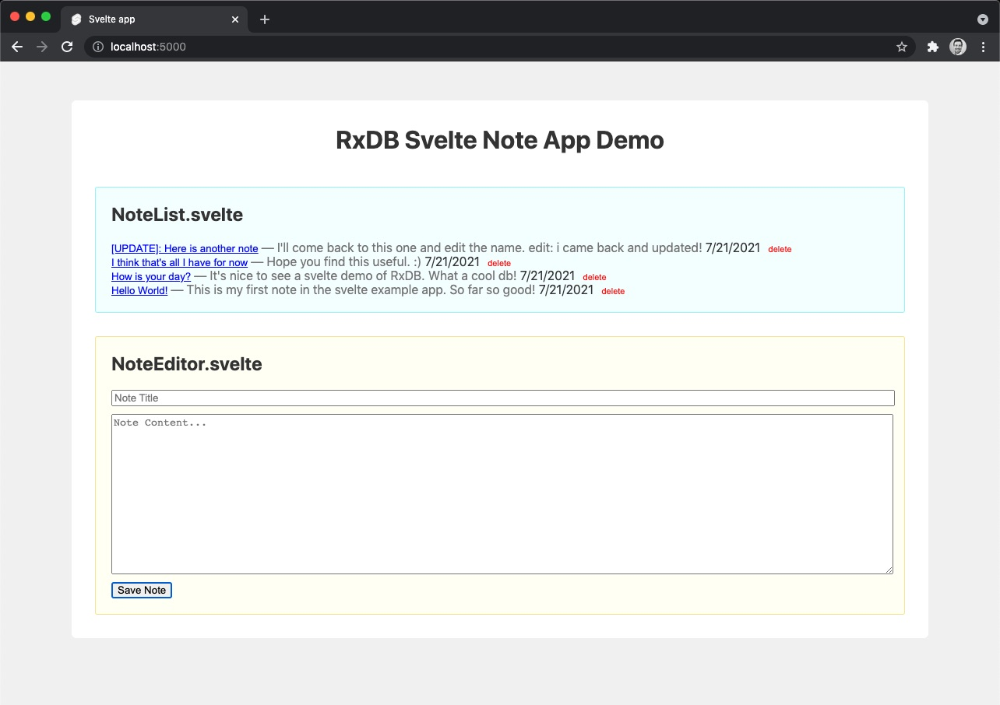

# RxDB in Svelte Demo



This is a quick note-taking app that demonstrates how to use RxDB within a Svelte app.

```sh
npm run preinstall && npm i && npm run dev
```

Then open [http://localhost:5000/](http://localhost:5000/)
