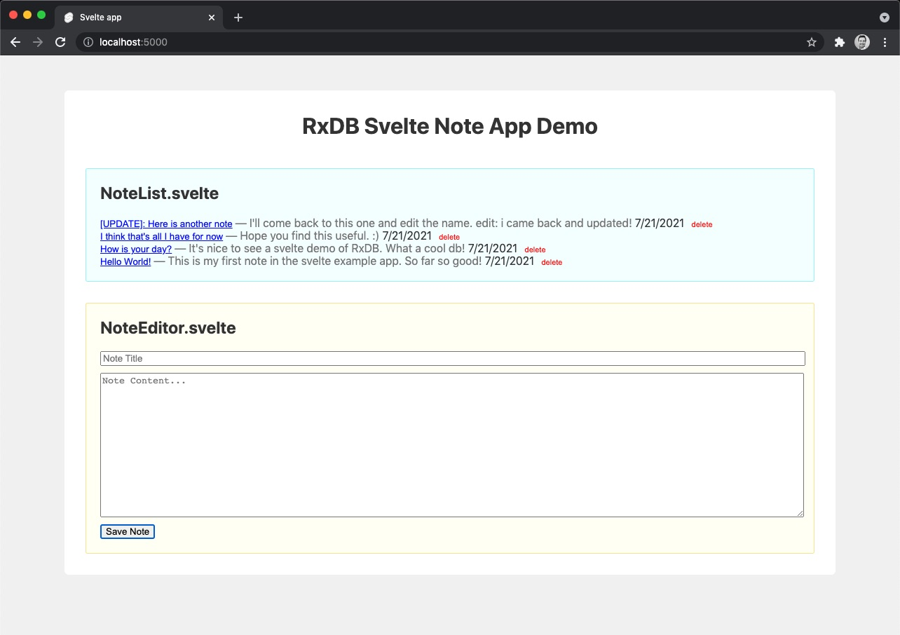

# RxDB in Svelte Demo



This is a quick note-taking app that demonstrates how to use RxDB within a Svelte app.
It runs on Svelte 5 and uses runes:

- Shared state lives in `src/store.svelte.js` and is created with `$state`.
- `src/NoteList.svelte` subscribes to the RxDB query inside an `$effect`, which also unsubscribes when the component is destroyed.
- `src/main.js` starts the app with `mount()` instead of `new App()`.

```sh
npm run preinstall && npm i && npm run dev
```

Then open [http://localhost:5000/](http://localhost:5000/)
