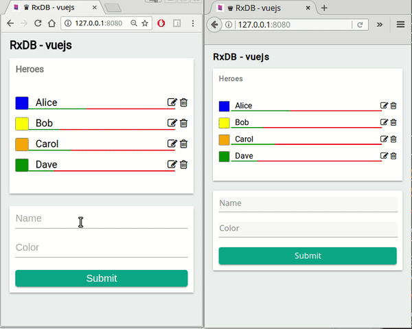

# RxDB vuejs example

This is an example usage of RxDB with VueJS. It implements a simple heroes-list which can be filled by the user.

# Try it out
1. clone the whole [RxDB-repo](https://github.com/pubkey/rxdb)
2. go into project `cd rxdb`
3. run `npm install`
4. go to this folder `cd examples/vue`
5. run `npm install`
6. run `npm start`
7. Open [http://127.0.0.1:8080/](http://127.0.0.1:8080/) **IMPORTANT: do not use localhost**

----
Created from [vuejs-templates/webpack-simple](https://github.com/vuejs-templates/webpack-simple).
